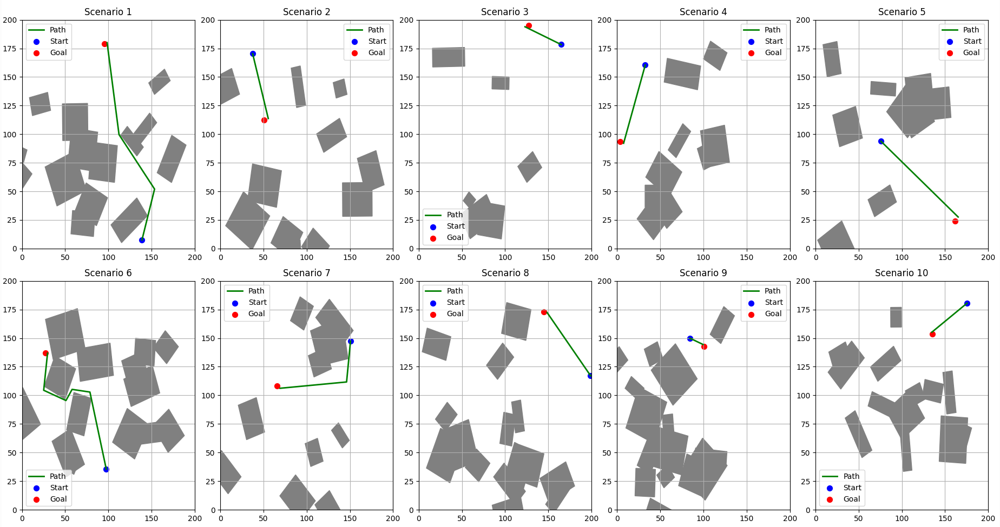

# RRTSubgoalEnhanced: An Enhanced RRT Algorithm with Subgoal Sampling, Bottleneck Detection, and Smoothing

This project implements an enhanced version of the Rapidly-exploring Random Tree (RRT) algorithm, designed to efficiently navigate complex environments. The algorithm includes several improvements over the traditional RRT, such as bottleneck detection, subgoal sampling, and path smoothing. It is well-suited for motion planning tasks in the presence of obstacles.

## Features

- **Subgoal Sampling**: Biased sampling towards bottleneck regions to improve exploration and goal-reaching.
- **Bottleneck Detection**: Detects areas of high node density and adjusts sampling to overcome local minima in exploration.
- **Path Smoothing**: Implements a two-phase path smoothing process to optimize the final path for directness and smoothness.
- **Batch Rewiring with Threading**: Utilizes multi-threading for efficient batch processing of node rewiring, improving path quality dynamically.

## Installation

1. Clone this repository:
   ```bash
   git clone https://github.com/yourusername/RRTSubgoalEnhanced.git
   cd RRTSubgoalEnhanced
   ```

2. Install the required dependencies:
   ```bash
   pip install -r requirements.txt
   ```

3. The dependencies include:
   - `numpy`: For numerical operations.
   - `matplotlib`: For visualization and obstacle generation.
   - `scipy`: For KD-Tree implementation and nearest neighbor search.
   - `concurrent.futures`: For multi-threaded rewiring.

## Usage

You can run the algorithm with randomly generated obstacles and start/goal positions. The code will generate and visualize several different scenarios, showing paths found or indicating if no path exists.

### Example Code

```python
from RRTSubgoalEnhanced import RRTSubgoalEnhanced, generate_random_obstacles

# Map parameters
map_size = (200, 200)  # Map dimensions
num_obstacles = 10     # Number of obstacles

# Generate random obstacles
obstacles = generate_random_obstacles(num_obstacles, map_size)

# Set start and goal positions
start = (10, 10)
goal = (190, 190)

# Initialize the RRT algorithm
rrt = RRTSubgoalEnhanced(start, goal, obstacles, map_size)

# Run the planning algorithm
path = rrt.planning()

if path:
    print("Path found!")
    # Optionally visualize the path
else:
    print("No path found.")
```

### Visualization

The algorithm will automatically generate and visualize several scenarios, plotting the obstacles, start, goal, and the path (if found). Below is an example of a scenario visualization.



### Parameters

- `start`: The (x, y) coordinates of the starting position.
- `goal`: The (x, y) coordinates of the goal position.
- `map_size`: A tuple defining the size of the environment (width, height).
- `step_size`: The maximum step size between nodes (default: 5 units).
- `max_iter`: The maximum number of iterations to run the RRT algorithm (default: 2000).
- `goal_tolerance`: The distance threshold for considering the goal as reached (default: 5 units).

## Algorithm Overview

The `RRTSubgoalEnhanced` class implements several key methods:

- **`get_random_node()`**: Generates a random node within the map boundaries with a bias towards subgoals.
- **`nearest_node(random_node)`**: Finds the nearest node in the tree using a KD-Tree for fast lookup.
- **`is_collision(node1, node2)`**: Checks for collisions along the path between two nodes.
- **`steer(from_node, to_node)`**: Steers a new node from the source towards the destination, constrained by step size.
- **`rewiring(new_node)`**: Performs rewiring of nearby nodes for cost optimization using multi-threading.

## Path Smoothing

The algorithm applies two levels of path smoothing:
1. **Line-of-Sight Check**: Removes unnecessary nodes by checking if a direct path between nodes is feasible.
2. **Spline Smoothing (optional)**: Further refines the path for a smoother trajectory.

## Contributing

Contributions are welcome! Here’s how you can help:
1. Fork the repository.
2. Create a feature branch:
   ```bash
   git checkout -b feature/my-new-feature
   ```
3. Commit your changes:
   ```bash
   git commit -am 'Add my new feature'
   ```
4. Push to the branch:
   ```bash
   git push origin feature/my-new-feature
   ```
5. Create a new Pull Request.

### Contribution Ideas

- Add spline-based smoothing for more refined paths.
- Implement additional collision detection methods for more complex obstacles.
- Experiment with parameter tuning for larger and more complex environments.

## License

This project is licensed under the MIT License - see the [LICENSE](LICENSE) file for details.

## Acknowledgements

- The project builds upon the traditional RRT algorithm and introduces several enhancements inspired by research in motion planning and optimization.
